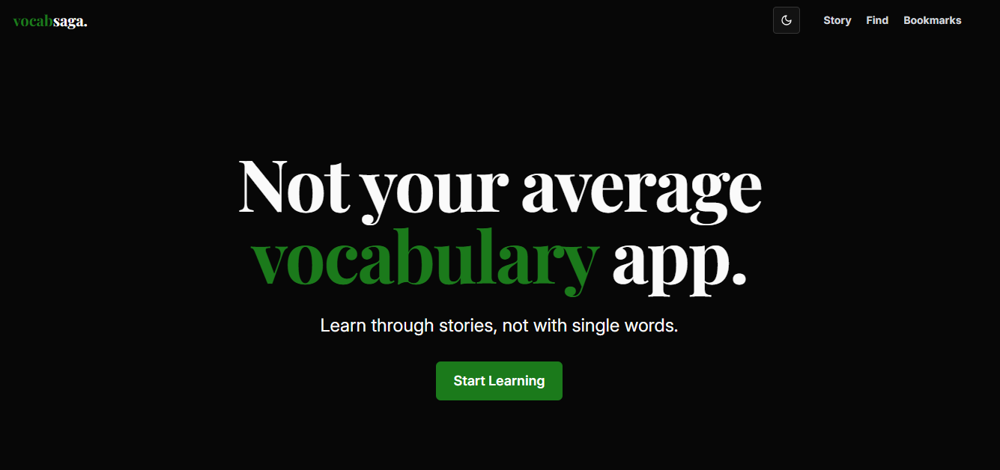

# [Vocabsaga](https://www.vocabsaga.space/)

A platform to boost your vocabulary.

No boring flashcards. Just immersive stories.

## Why Vocabsaga?

**Because context matters.**

Humans crave stories, not dry definitions.

A word sticks when it’s part of a narrative.

Think about it:
Random flashcard or gripping story?

Which sparks your memory?

Vocabsaga chooses stories. Every time.

## Key Features

- **Short passages:** Learn words through sentences instead memorizing a single word.  
- **Bookmark & Review:** Save words. Revisit them anytime. 
- **300+ Passages:** Dive into a growing library of stories.
- **Built-in Dictionary:** Instant meanings, no interruptions.  
- **Sleek UI:** Minimal design. Dark mode included.

## Get Started

1. Visit [vocabsaga.space](https://www.vocabsaga.space/).  
2. Pick a story. Any story.  
3. Read, learn, bookmark words.  
4. Come back and review.
5. Keep growing!

## Community

Share your journey with #vocabsaga.
<!-- Follow us on X. -->

<!-- ## What’s Next?
Quizzes to test your skills.
Personalized story picks.
Offline mode for learning anywhere. -->

Master words with Vocabsaga. The new age of learning vocabulary. Reading books still remain first!

### Made for readers, writers, and lifelong learners.